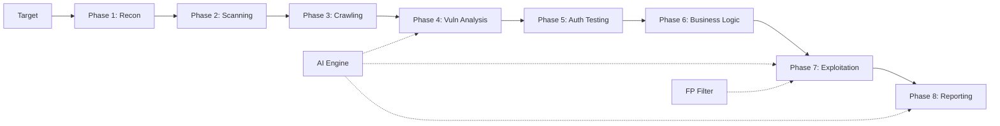

# 🛡️ Snooger v4.0 — Elite Penetration Testing Framework

<p align="center">
  
  
  
  
</p>

```
 ░▒▓███████▓▒░▒▓███████▓▒░ ░▒▓██████▓▒░ ░▒▓██████▓▒░ ░▒▓██████▓▒░░▒▓████████▓▒░▒▓███████▓▒░
░▒▓█▓▒░      ░▒▓█▓▒░░▒▓█▓▒░▒▓█▓▒░░▒▓█▓▒░▒▓█▓▒░░▒▓█▓▒░▒▓█▓▒░░▒▓█▓▒░▒▓█▓▒░      ░▒▓█▓▒░░▒▓█▓▒░
 ░▒▓██████▓▒░░▒▓█▓▒░░▒▓█▓▒░▒▓█▓▒░░▒▓█▓▒░▒▓█▓▒░░▒▓█▓▒░▒▓█▓▒▒▓███▓▒░▒▓██████▓▒░ ░▒▓███████▓▒░
░▒▓███████▓▒░░▒▓█▓▒░░▒▓█▓▒░░▒▓██████▓▒░ ░▒▓██████▓▒░ ░▒▓██████▓▒░░▒▓████████▓▒░▒▓█▓▒░░▒▓█▓▒░
```

**Snooger** is a professional, AI-powered penetration testing framework designed for Kali Linux. It automates the full pentest lifecycle — from reconnaissance to exploitation and reporting — with multi-provider AI analysis, interactive mode, and false-positive reduction.

---

## 📋 Table of Contents

- [Features](#-features)
- [Architecture](#-architecture)
- [Installation](#-installation)
- [Configuration](#-configuration)
- [Usage](#-usage)
- [Scan Phases](#-scan-phases)
- [AI Integration](#-ai-integration)
- [Interactive Mode](#-interactive-mode)
- [Outputs & Reports](#-outputs--reports)
- [Plugin System](#-plugin-system)
- [Troubleshooting](#-troubleshooting)

---

## ✨ Features

### Core Capabilities
| Feature | Description |
|---------|-------------|
| 🔍 **8-Phase Scan Pipeline** | Recon → Scanning → Crawling → Vuln Analysis → Auth → Business Logic → Exploitation → Reporting |
| 🤖 **Multi-AI Engine** | DeepSeek, Groq, OpenRouter (all free tier), Ollama (local) |
| 🎛️ **Interactive Mode** | User prompts at key decision points in each phase |
| 🛡️ **False-Positive Filter** | Confidence scoring, dedup, live verification, AI triage |
| 📊 **Professional Reports** | JSON + Markdown + AI-generated executive summary |
| ⚡ **Async Execution** | Concurrent scanning with rate limiting and WAF evasion |
| 🔌 **Plugin System** | Extensible architecture for custom scanners |
| 🔄 **Resume Support** | Save & resume scans with `--resume` |

### Security Testing Coverage
| Category | Tests |
|----------|-------|
| **Reconnaissance** | Subdomain enum, content discovery, historical URLs, subdomain takeover, info disclosure |
| **Scanning** | Port scanning (Nmap), tech detection, service fingerprinting, cloud scanning |
| **Web Crawling** | Deep crawling, JS analysis, secret extraction, parameter discovery |
| **Vuln Analysis** | Nuclei templates, SQLi, XSS, GraphQL, HTTP request smuggling, file upload, SSRF |
| **Authentication** | Login detection, brute force, session fixation, JWT analysis, cookie flags |
| **Business Logic** | IDOR, mass assignment, HPP, race conditions, API security testing |
| **Exploitation** | Exploit chain detection, AI PoC generation, secret validation, SQLMap integration |

---

## 🏗️ Architecture

```
snooger/
├── snooger.py              # Main orchestrator (8-phase pipeline)
├── config.yaml             # All configuration (AI, rate limit, phases)
├── .env                    # API keys (secret, not committed)
├── core/
│   ├── ai_engine.py        # Multi-provider AI with interactive selection
│   ├── interactive.py      # Rich TUI (tables, progress bars, menus)
│   ├── state_manager.py    # SQLite-based state persistence
│   ├── async_executor.py   # Concurrent task execution
│   ├── rate_limiter.py     # Request throttling & WAF evasion
│   ├── scope_manager.py    # Target scope management
│   ├── event_bus.py        # Inter-module event system
│   ├── http_client.py      # Async/sync HTTP with retry
│   ├── config_loader.py    # YAML config with env var expansion
│   ├── plugin_loader.py    # Plugin discovery & execution
│   └── notifications.py    # Telegram/Discord/Webhook alerts
├── modules/
│   ├── reconnaissance/     # Subdomain, content, takeover, historical
│   ├── scanning/           # Port scan, tech detect, cloud
│   ├── crawler/            # Web crawler & JS analyzer
│   ├── vulnerability/      # Nuclei, SQLi, XSS, smuggling, GraphQL
│   ├── auth/               # Authentication & session testing
│   ├── business_logic/     # IDOR, race conditions, mass assignment
│   ├── exploitation/       # Chain engine, exploit selector, SQLMap
│   ├── validation/         # False-positive filter & AI triage
│   ├── api/                # API endpoint security testing
│   ├── evasion/            # WAF bypass techniques
│   ├── reporting/          # JSON/Markdown report generation
│   └── post_exploitation/  # Linux privilege escalation checks
├── plugins/                # Custom scanner plugins
├── data/                   # Wordlists, payloads, templates
└── workspace/              # Scan output directories
```

### How It Works



Each phase feeds data into the next. AI is used for:
- Vulnerability prioritization (Phase 4)
- Exploit chain detection (Phase 7)
- PoC generation (Phase 7)
- Executive summary (Phase 8)
- False-positive triage (Phase 7)

---

## 🚀 Installation

### Prerequisites

- **Kali Linux** (recommended) or any Debian-based Linux
- **Python 3.10+**
- **Root/sudo access** (for Nmap)

### Step 1: Clone Repository

```bash
git clone https://github.com/anbu777/snooger.git
cd snooger
```

### Step 2: Run Setup Script

```bash
chmod +x setup_kali.sh
sudo ./setup_kali.sh
```

This installs: `nmap`, `nuclei`, `subfinder`, `httpx`, `ffuf`, `waybackurls`, and other tools.

### Step 3: Create Python Virtual Environment

```bash
python3 -m venv snooger-env
source snooger-env/bin/activate
pip install -r requirements.txt
```

### Step 4: Configure API Keys

```bash
cp .env.example .env
nano .env
```

Add at least ONE AI provider key (all are free):

| Provider | Free Tier | Get Key |
|----------|-----------|---------|
| **DeepSeek** | 10M tokens free | [platform.deepseek.com](https://platform.deepseek.com) |
| **Groq** | 14,400 tokens/min | [console.groq.com](https://console.groq.com) |
| **OpenRouter** | Free models available | [openrouter.ai/keys](https://openrouter.ai/keys) |
| **Ollama** | Unlimited (local) | [ollama.com](https://ollama.com) |

### Step 5: Verify Installation

```bash
python snooger.py --help
```

---

## ⚙️ Configuration

### `config.yaml` — Key Settings

```yaml
ai:
  mode: "auto"                    # auto | smart | light | off
  primary_provider: "deepseek"    # Which AI to try first
  fallback_chain: ["groq", "openrouter", "ollama"]  # Auto-switch order

rate_limit:
  requests_per_second: 10         # Throttle to avoid bans
  burst: 50                       # Max burst requests

stealth:
  random_delay: [0.5, 2.0]       # Random delay between requests
  rotate_user_agents: true        # Rotate User-Agent headers
```

### AI Mode Explained

| Mode | Behavior | Best For |
|------|----------|----------|
| `auto` | AI for complex tasks, rule-based for simple | Default / balanced |
| `smart` | AI for all analysis | Deep analysis |
| `light` | Minimal AI (classification only) | Fast scans |
| `off` | No AI at all | Offline / speed |

---

## 🎯 Usage

### Basic Scan

```bash
python snooger.py -t example.com
```

### With Interactive Mode

```bash
python snooger.py -t example.com --interactive
```

Interactive mode prompts you at:
- **Phase 1**: Choose recon depth (Quick / Standard / Deep)
- **Phase 4**: Choose severity filter (Critical+High / +Medium / All)
- **Phase 7**: Choose PoC generation (Auto / Review first / Skip)
- **Startup**: Select AI provider + view credit status

### With Specific Profile

```bash
# Fast scan — basic recon + top vulns only
python snooger.py -t example.com -p quick

# Stealth scan — slow, randomized, WAF evasion
python snooger.py -t example.com -p stealth

# Thorough scan — comprehensive, all checks
python snooger.py -t example.com -p thorough

# Aggressive scan — fast, loud, maximum coverage
python snooger.py -t example.com -p aggressive
```

### Resume a Scan

```bash
python snooger.py --resume workspace/example.com_20260313_010712
```

### Authenticated Scanning

```bash
# With session cookie
python snooger.py -t app.example.com --cookie "session=abc123"

# With JWT token
python snooger.py -t api.example.com --jwt "eyJhbGci..."

# With custom headers
python snooger.py -t example.com --header "Authorization:Bearer token123"
```

### Skip Exploitation (Safe Mode)

```bash
python snooger.py -t example.com --skip-exploit
```

### Full Command Reference

```
Usage: snooger.py [-h] [-t TARGET] [-p {quick,stealth,thorough,aggressive}]
                  [-s SCOPE] [--exclude EXCLUDE] [-c CONFIG] [-w WORKSPACE]
                  [--skip-exploit] [--recon-only] [--vuln-only]
                  [--cookie COOKIE] [--header HEADER] [--jwt JWT]
                  [--login-url LOGIN_URL] [--ai-mode {auto,smart,light,off}]
                  [--interactive] [-v] [-q] [--json-output JSON_OUTPUT]
                  [--list-plugins] [--no-plugins] [--resume RESUME]
```

---

## 🔄 Scan Phases

### Phase 1: Reconnaissance
> Subdomain enumeration, content discovery, alive host checking

- Uses: `subfinder`, `amass`, `ffuf`, Wayback Machine
- **NEW**: Historical URL fetching, subdomain takeover detection, info disclosure scanning
- Output: Subdomains, directories, technologies detected

### Phase 2: Port Scanning & Tech Detection
> Network-level scanning and technology fingerprinting

- Uses: `nmap` (SYN scan, service version, scripts)
- Detects: Open ports, services, OS, WAF presence

### Phase 3: Web Crawling & JS Analysis
> Deep web crawling and JavaScript source analysis

- Uses: Custom async crawler + BeautifulSoup + regex
- Finds: URLs, forms, parameters, JS secrets (API keys, tokens, credentials)

### Phase 4: Vulnerability Analysis
> Automated vulnerability scanning with multiple engines

- Uses: `nuclei` (templates), custom testers (SQLi, XSS, GraphQL, smuggling, upload)
- AI: Prioritizes findings by exploitability

### Phase 5: Authentication Testing
> Login form detection and auth vulnerability testing

- Tests: Session fixation, cookie security flags, brute force, JWT weaknesses
- Auto-detects: Login URLs, auth mechanisms

### Phase 6: Business Logic Testing
> Tests for logic flaws beyond traditional vulnerabilities

- Tests: IDOR, mass assignment, HTTP parameter pollution
- **NEW**: Race condition testing, API endpoint security, GraphQL introspection

### Phase 7: Exploitation & PoC Generation
> Validates findings and generates proof-of-concept exploits

- AI: Detects exploit chains (e.g., SSRF + Internal API = RCE)
- AI: Generates bug bounty-ready PoC reports
- FP Filter: Removes false positives via confidence scoring + live verification
- **NEW**: Secret validation (AWS, Slack, GitHub tokens)

### Phase 8: Report Generation
> Professional report with executive summary

- Outputs: `final_report.json`, `report.md`
- AI: Generates executive summary and remediation advice

---

## 🤖 AI Integration

### How AI Works in Snooger

```
┌─────────────────┐     ┌──────────────┐     ┌──────────────┐
│   DeepSeek      │────▶│              │     │ Vuln Triage  │
│   (primary)     │     │   AI Engine  │────▶│ PoC Gen      │
├─────────────────┤     │   v4.0       │     │ Chain Detect │
│   Groq          │────▶│              │     │ FP Reduction │
│   (fallback 1)  │     │  Auto-switch │     │ Summary Gen  │
├─────────────────┤     │  on 429/fail │     └──────────────┘
│   OpenRouter    │────▶│              │
│   (fallback 2)  │     └──────────────┘
├─────────────────┤
│   Ollama        │ (local, unlimited)
└─────────────────┘
```

### Interactive AI Selection

When running with `--interactive`, you'll see:

```
┌──────────────────────────────────────────────┐
│ 🤖 AI Provider Status                        │
├───┬──────────────┬──────────┬────────────────┤
│ # │ Provider     │ Status   │ Credit         │
├───┼──────────────┼──────────┼────────────────┤
│ 1 │ 🧠 DeepSeek  │ ✅ Ready │ ████████░ ~80% │
│ 2 │ ⚡ Groq      │ ✅ Ready │ ██████████ ~95%│
│ 3 │ 🌐 OpenRouter│ ❌ No Key│ Not configured │
│ 4 │ 🖥️ Ollama    │ ✅ Ready │ ████████████ ∞ │
└───┴──────────────┴──────────┴────────────────┘

Select primary AI provider:
  [1] 🧠 DeepSeek (current)
  [2] ⚡ Groq Cloud
  [3] 🖥️ Ollama (Local)
Choice [1-3]: 
```

### Auto-Fallback

If DeepSeek's free tier runs out (HTTP 429), Snooger automatically:
1. Logs: `"AI provider 'deepseek' credit exhausted. Switching to next."`
2. Switches to Groq
3. If Groq also exhausted → OpenRouter → Ollama
4. If all fail → continues without AI (rule-based fallback)

---

## 🎛️ Interactive Mode

Flag: `--interactive` or `-i`

| Phase | Prompt | Options |
|-------|--------|---------|
| Startup | AI provider selection | DeepSeek / Groq / OpenRouter / Ollama |
| Phase 1 | Recon depth | Quick / Standard / Deep |
| Phase 4 | Severity filter | Critical+High / +Medium / All |
| Phase 7 | PoC mode | Automatic / Review first / Skip |

When interactive is **disabled**, Snooger runs fully automated with defaults.

---

## 📊 Outputs & Reports

All outputs are saved to `workspace/<target>_<timestamp>/`:

```
workspace/example.com_20260313_010712/
├── final_report.json       # Full structured report
├── report.md               # Human-readable Markdown report
├── nmap_results.xml        # Raw Nmap data
├── nuclei_results.json     # Raw Nuclei findings
├── crawl_results.json      # Crawled URLs & forms
├── js_secrets.json         # Extracted JS secrets
├── state.db                # SQLite state (for --resume)
└── snooger.log             # Detailed execution log
```

---

## 🔌 Plugin System

Create custom scanners in `plugins/`:

```python
# plugins/my_scanner.py
PLUGIN_INFO = {
    'name': 'My Custom Scanner',
    'version': '1.0',
    'category': 'vuln',
    'description': 'Custom vulnerability checks',
}

def scan(context):
    """Called during the matching phase."""
    target = context.target
    # Your scanning logic here
    return [{'type': 'custom_vuln', 'severity': 'high', 'url': target}]
```

```bash
python snooger.py --list-plugins    # List loaded plugins
python snooger.py --no-plugins      # Disable plugins
```

---

## 🔧 Troubleshooting

### Common Issues

| Issue | Solution |
|-------|----------|
| `AI engine initialization failed` | Check `.env` file has valid API keys |
| `Nuclei timeout` | Normal for large targets — increase in `config.yaml` |
| `Phase 5/6 skip` | No login forms / parameterized URLs found — expected for static sites |
| `Permission denied (Nmap)` | Run with `sudo` or configure passwordless sudo |
| `No module named 'rich'` | Run `pip install -r requirements.txt` |

### Verify Tools

```bash
bash check_tools.sh
```

### Check AI Status

```bash
python -c "
from core.config_loader import load_config
from core.ai_engine import AIEngine
config = load_config('config.yaml')
ai = AIEngine(config, interactive=True)
"
```

---

## 📄 License

Private repository. All rights reserved.

---

<p align="center">
  <b>Built for ethical penetration testing only. Always get written authorization before testing.</b>
</p>
